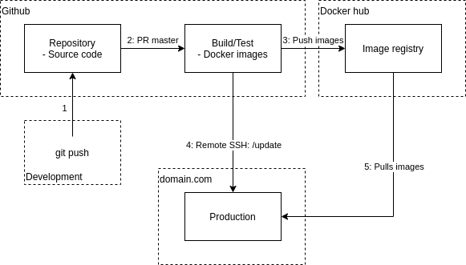
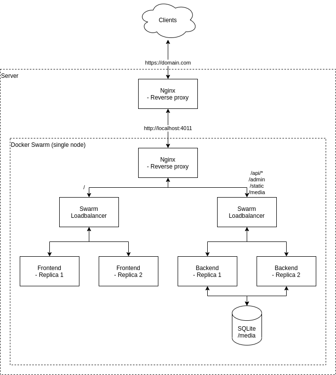

# SecFit

SecFit (Secure Fitness) is a hybrid mobile application for fitness logging.

## Content
This project contains 3 applications.
- [Backend](./backend/README.md) (Python - Django)
- [Frontend](./frontend/README.md) (JS/HTML - Cordova)
- [Testing](./testing/README.md) (JS - node)

## Development in VS code remote container

Prerequisites:

- VS code with remote development extension
- Docker

To develop in remote containers open a separate VS code instance inside both backend and frontend. Use VS code's command (Ctrl + P) ">Remote-Containers: Open Folder In Container..."

Benefits using this development environment:

- Development environment is identical to the production environment (uses the same dockerfile). This leads to fewer surprises when deploying.
- No manual installation steps needed
- No cleanup
- Easy to switch between different projects using different dependencies/technologies

## Deploy

### Prerequisites:

Docker Compose/Swarm

### Info:

- The deployment uses prebuilt images from docker hub, built with github actions

### Deploy with Docker Compose:

```
docker-compose up
```

Hosts the application on http://localhost:4011

### Deploy (or update) with Docker Swarm

Prerequisites:

- Git clone, or copy `db.sqlite3`, `docker-compose.yaml`, `nginx.conf` and `.env` to the server.

```
docker stack deploy --compose-file docker-compose.yml --with-registry-auth stack-secfit
```

Hosts the application on http://localhost:4011

## CI/CD Pipeline

### Master branch
The following figure represents the CI/CD pipeline on master branch:


1. Developers push code to github
2. A PR to master branch is created. On merge, a new docker image per service is built. While building the image, tests are executed.
3. After github actions has built the images they are pushed to docker hub.
4. A github action connects to the production server using SSH and executes a script `./update`.
5. This script tells docker swarm to update the services. Docker swarm pulls the new images from docker hub, and restarts the services using these images.

### All branches

- There are built docker images containing tests, on push and pull requests for all branches

## Production environment
The following figure represents the running services in the production environment:


- The first reverse proxy terminates SSL/TLS and routes traffic to different docker stacks running on the server
- Application services are running in Docker swarm
- The second reverse proxy routes traffic at `/` to frontend and `/api/* ...` to backend. 
- Swarm load balancer routes traffic to services running the same application
- 2 replicas on each service prevents down time during updates
- Persistent data by storing SQLite file and media folder on the servers

## Technology

- **deployment** Docker swarm/compose
- **proxy** Nginx
- **database** SQLite
- **backend** Django 3 with Django REST framework
- **frontend**
  - **browser** - HTML5/CSS/JS, Bootstrap v5 (no jQuery dependency)
  - **mobile** Apache Cordova (uses same website)
- **authentication** JWT


## Code and structure

.gitlab-ci.yml - gitlab ci
requirements.txt - Python requirements
package.json - Some node.js requirements, this is needed for cordova

- **secfit/** django project folder containing the project modules
  - **<application_name>/** - generic structure of a django application
    - **admins.py** - file contaning definitions to connect models to the django admin panel
    - **urls.py** - contains mapping between urls and views
    - **models.py** - contains data models
    - **permissions.py** - contains custom permissions that govern access
    - **serializers.py** - contains serializer definitions for sending data between backend and frontend
    - **parsers.py** - contains custom parsers for parsing the body of HTTP requests
    - **tests/** - contains tests for the module. [View Testing in Django](https://docs.djangoproject.com/en/2.1/topics/testing/) for more.
    - **views.py** - Controller in MVC. Methods for rendering and accepting user data
    - **forms.py** - definitions of forms. Used to render html forms and verify user input
    - **settings.py** - Contains important settings at the application and/or project level
    - **Procfile** - Procfile for backend heroku deployment
  - **media/** - directory for file uploads (need to commit it for heroku)
  - **comments/** - application handling user comments and reactions
  - **secfit/** - The projects main module containing project-level settings.
  - **users/** - application handling users and requests
  - **workouts/** - application handling exercises and workouts
  - **manage.py** - entry point for running the project.
  - **seed.json** - contains seed data for the project to get it up and running quickly (coming soon)

### Django basics

Installation with examples for Ubuntu. Windows and OSX is mostly the same

Fork the project and clone it to your machine.

#### Setup and activation of virtualenv (env that prevents python packages from being installed globaly on the machine)

Naviagate into the project folder, and create your own virtual environment

#### Install python requirements

`pip install -r requirements.txt`

#### Migrate database

`python manage.py migrate`

#### Create superuser

Create a local admin user by entering the following command:

`python manage.py createsuperuser`

Only username and password is required

#### Start the app

`python manage.py runserver`

#### Add initial data

You can add initial data either by going to the url the app is running on locally and adding `/admin` to the url.

Add some categories and you should be all set.

Or by entering

`python manage.py loaddata seed.json`

### Cordova

Cordova CLI guide: https://cordova.apache.org/docs/en/latest/guide/cli/
If you want to run this as a mobile application

- Navigate to the frontend directory
- For android, do `cordova run android`
- For ios, do `cordova run ios`
- For browser, do `cordova run browser`

It's possible you will need to add the platforms you want to run and build.
The following documentation can be used to run the application in an Android emulator: \
https://cordova.apache.org/docs/en/latest/guide/platforms/android/index.html
