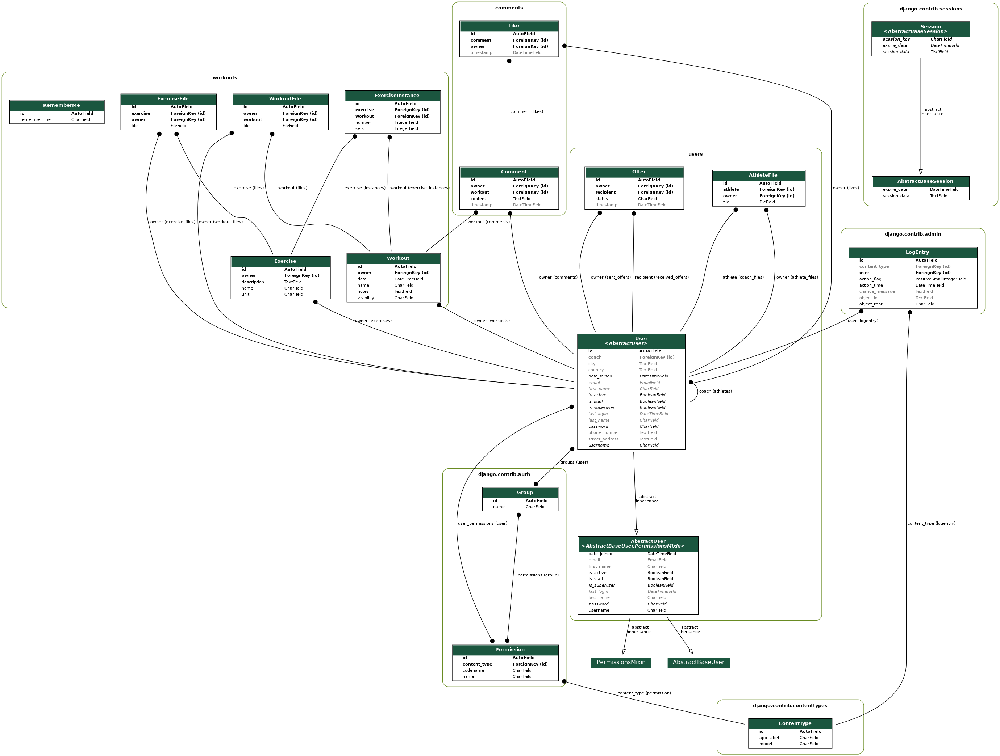

# Overview pipeline

Current CI/CD configuration.

# Exercises

Migrations of exercises including owner and exercisefiles.

  

    <h5>Owner field</h5>
    </img>
  

  

    <h5>Exercise files</h5>
    </img>
  

